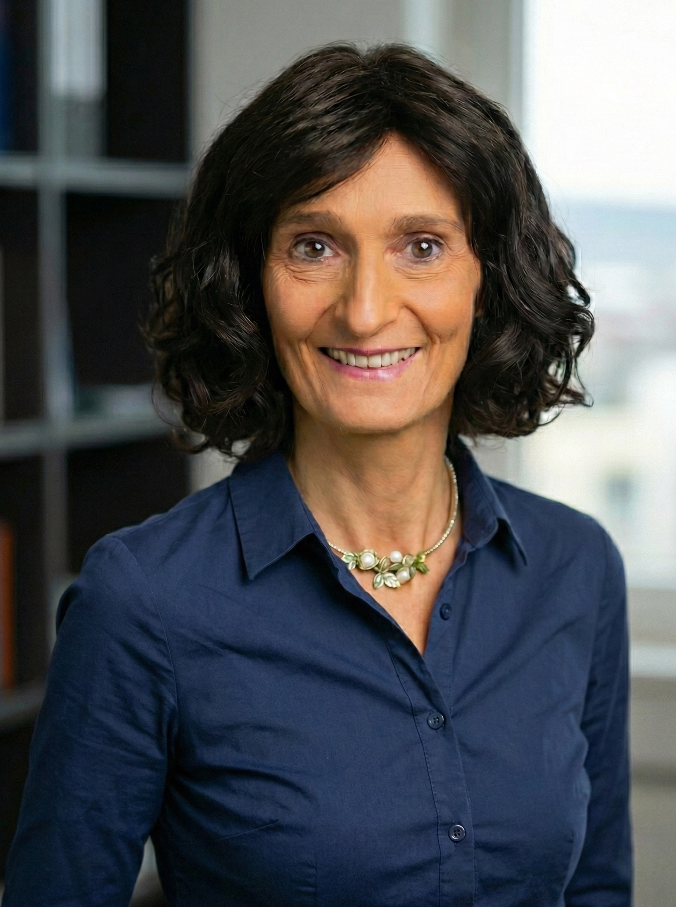

**MSP Consulting Meyer-Steigmeier stands for competence, discretion, and Swiss reliability.**

We do not see ourselves as a large, anonymous agency, but as your personal representative in Switzerland. Our focus is on providing individual support to private individuals and companies who do not wish to navigate the Swiss administration alone.

Our philosophy is simple: We handle the bureaucracy so that you can focus on what matters most. We know the channels, the forms, and—often even more importantly—the contact persons at the authorities.

---

## Management

### Esther Meyer-Steigmeier
**Owner & Senior Consultant**

{: .image-left width="250"}

With the founding of MSP Consulting, I made it my mission to build a bridge between my clients and the Swiss authorities.

Thanks to my many years of experience in the administrative and immigration law sector, I know the challenges that newcomers and international companies face firsthand. I attach great importance to pragmatic solutions and open, direct communication.

**My Focus Areas:**
* Strategic advice on settlements
* Complex permit procedures
* Administrative mandates
* Networking with decision-makers

> "Every case is unique. That is why I do not offer standard solutions, but strategies tailored to your specific situation."

---

### Our Network
No one can do it all alone. For specific legal questions (e.g., in complex tax law or legal disputes), we rely on a proven network of **lawyers, notaries, and tax experts**. We coordinate these specialists for you, ensuring that you continue to have a single point of contact.
